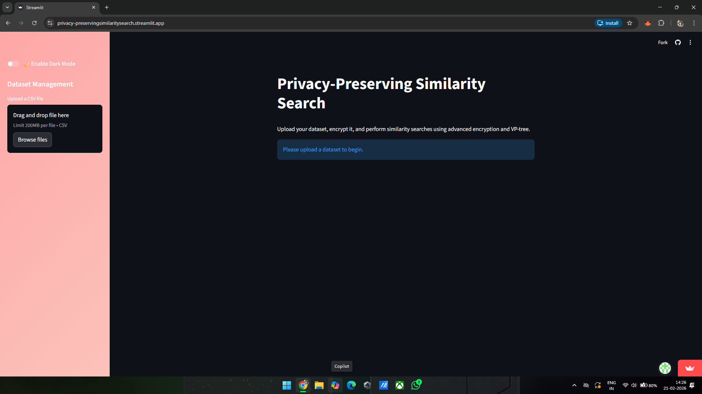
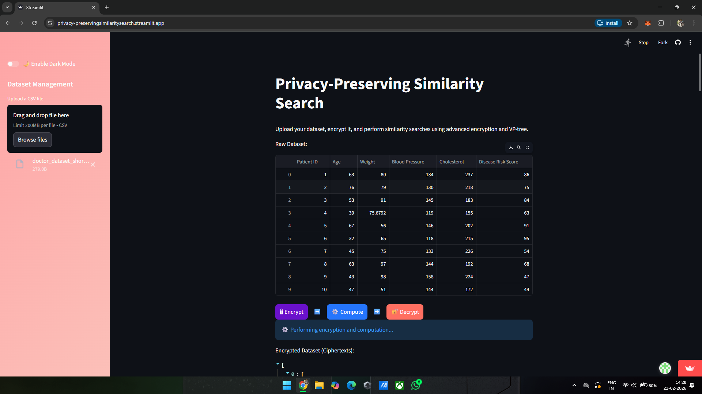
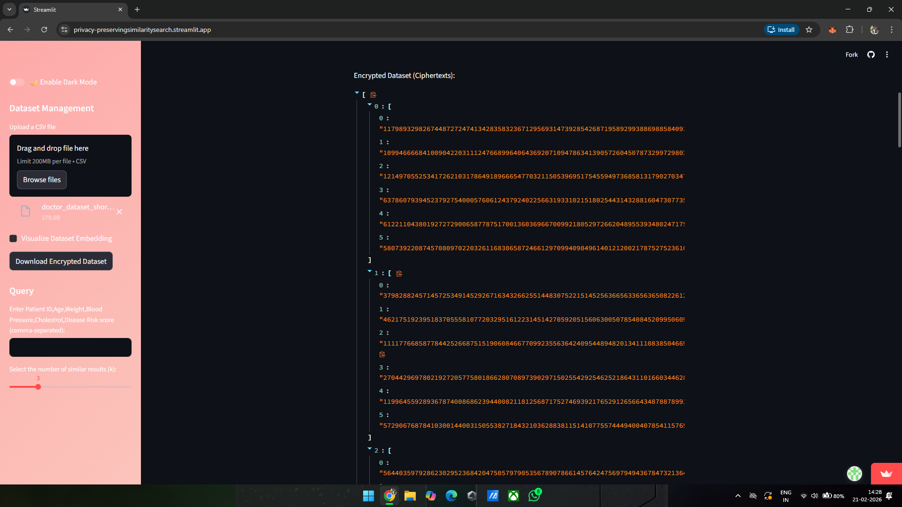
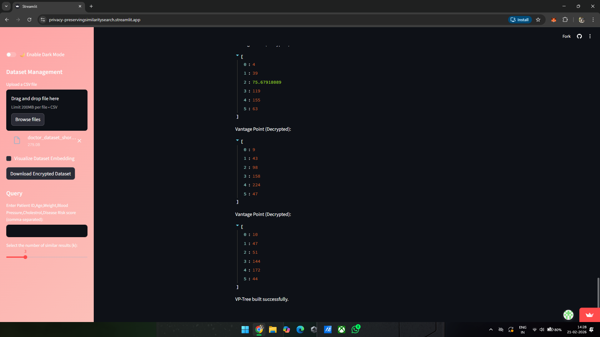
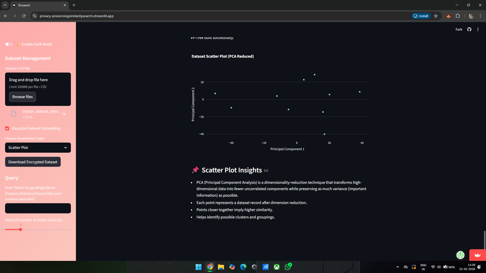
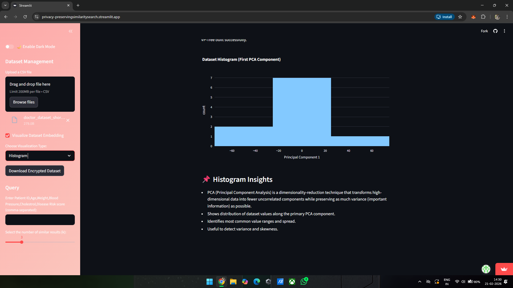
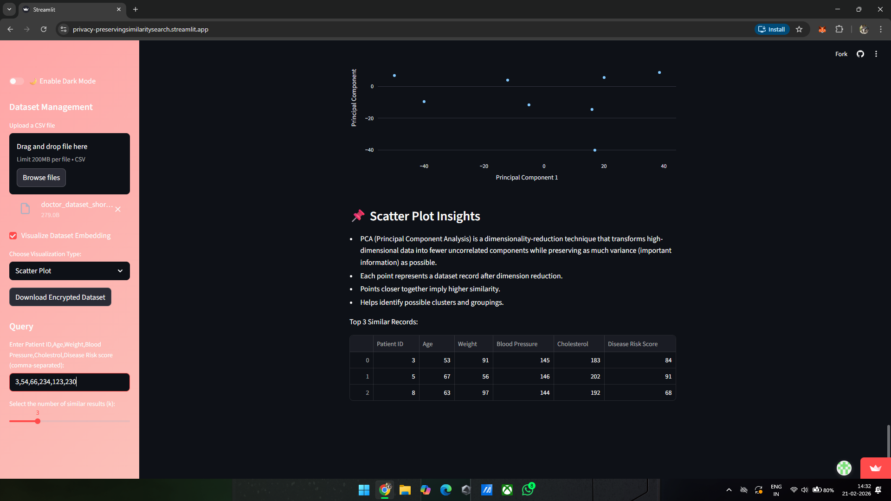
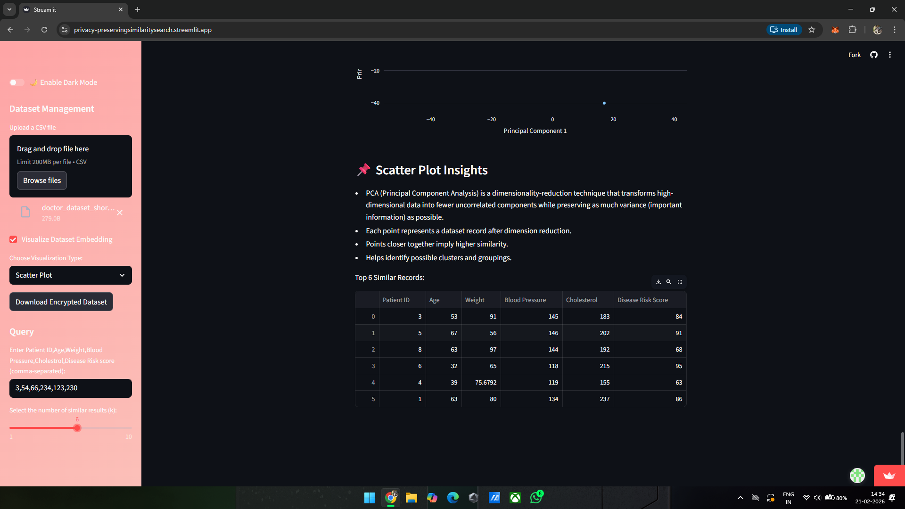

# 🔐 Privacy-Preserving Similarity Search in Cloud

A secure similarity search framework that enables users to retrieve similar data records **without exposing sensitive information** to the cloud server.

This project integrates **Paillier Homomorphic Encryption (HE)** with **Vantage Point (VP) Trees** to perform efficient similarity searches directly on encrypted data — ensuring complete privacy and confidentiality.

---

## 📌 Project Overview

Traditional cloud-based similarity search systems require access to plaintext data, which creates major privacy risks.

This system solves the problem by:

- Encrypting both datasets and user queries  
- Performing similarity computations over encrypted data  
- Returning encrypted results that only the user can decrypt  

The cloud server never sees the original data.

---

## ✨ Key Features

- 🔐 **End-to-End Encryption**  
  Dataset and user queries remain encrypted during storage and processing.

- 🧮 **Homomorphic Computation**  
  Similarity calculations are performed without decrypting the data.

- 🌳 **VP Tree-Based Indexing**  
  Efficient hierarchical partitioning for high-dimensional similarity search.

- 👤 **User-Controlled Decryption**  
  Only the user holds the private key to decrypt final results.

- 🖥️ **Interactive Streamlit UI**  
  Simple interface for uploading datasets, encrypting queries, and retrieving results.

---

## 🧠 Technologies Used

- Paillier Homomorphic Encryption  
- Vantage Point Tree (VP-Tree)  
- Python  
- NumPy  
- Streamlit  

---

## 🏗️ System Architecture
User → Encrypt Data → Upload to Cloud
Cloud → Build VP Tree → Perform Encrypted Similarity Search
Cloud → Return Encrypted Results
User → Decrypt Results Locally


---

## 🚀 How It Works

1. **Key Generation**  
   User generates Paillier public/private key pair.

2. **Dataset Encryption**  
   Dataset is encrypted locally using the public key.

3. **Query Encryption**  
   User encrypts query vector before sending it to the cloud.

4. **VP Tree Construction**  
   Cloud builds a VP Tree index for efficient search.

5. **Homomorphic Distance Computation**  
   Similarity calculations are performed on encrypted values.

6. **Encrypted Result Return**  
   Cloud sends encrypted nearest neighbors.

7. **Local Decryption**  
   User decrypts results using the private key.

---
## 📂 Project Structure
```
privacy-preserving-similarity-search/
│
├── app.py
├── encryption.py
├── vp_tree.py
├── similarity.py
└── requirements.txt
```
---
## ⚙️ Installation & Setup

### 1️⃣ Clone the Repository

```bash
git clone https://github.com/Sheikh-13/Privacy-Preserving_Similarity_Search_in_Cloud.git
cd Privacy-Preserving_Similarity_Search_in_Cloud
```
### 1️⃣ Install Dependencies

```bash
pip install -r requirements.txt
```
### 1️⃣ Run the Application

```
streamlit run app.py

```
---

## 📸 Screenshots

<div align="center">

###  **Home/Initial Interface**
*Dataset Upload Page*



###  **Dataset Preview Page**
*Preview Raw Dataset before Encryption*



###  **Encryption Visualization page**
*Visaualize Encrypted Dataset in a Structured JSON-like format*



###  **VP-Tree Build Completion Page**
*Multiple Decrypted Vantage-points(VPs) used to structure the VP-Tree*



###  **Dataset Embedding Visualization**
*A 2D PCA-reduced scatter plot where each point corresponds to a dataset record*



*The Histogram shows thefrequency distribution of reduced dataset values*



###  **Query Input and Similarity Search Results**
*Query Entry and Selection of Number of similar results(k)*




---
</div>

---

## 📊 Applications


- 🏥 **Healthcare**  
  Secure comparison of encrypted patient records without exposing sensitive medical data.

- 💳 **Finance**  
  Fraud detection and transaction similarity analysis while preserving customer confidentiality.

- 🛍️ **E-Commerce**  
  Privacy-preserving recommendation systems that analyze user behavior securely.

- 🧬 **Biometrics**  
  Encrypted face or fingerprint matching without revealing biometric templates.

- 🏢 **Cloud Data Outsourcing**  
  Secure similarity search for organizations storing sensitive data on third-party servers.


---

## 🔒 Security Advantages

- 🔐 **Data Confidentiality**  
  All data remains encrypted during storage and processing.

- 🔑 **User-Owned Private Key**  
  Only the user can decrypt the final results.

- ☁️ **Untrusted Cloud Model**  
  The cloud performs computations without ever accessing plaintext data.

- 🛡️ **Reduced Data Leakage Risk**  
  Protects against insider threats and external attacks on cloud storage.

- 📜 **Regulatory Compliance Ready**  
  Suitable for privacy-sensitive domains like healthcare and finance (GDPR-aligned architecture).


---

## 🎯 Future Improvements

- 🚀 Optimization for large-scale, high-dimensional datasets  
- ⚡ Performance benchmarking against plaintext similarity search  
- 🔗 Integration with blockchain for audit logging and integrity verification  
- 🧠 Support for advanced similarity metrics (Cosine, Manhattan distance)  
- 🌐 Deployment on cloud platforms (AWS, Azure, GCP)  
- 🔒 Integration with fully encrypted indexing structures  


---

## 👨‍💻 Author

**Sheikh Muhammad Tauheed**  
Final Year Computer Science Engineering Student  

🔹 Interests:  
Artificial Intelligence | Cybersecurity | Blockchain Technology | Cloud Computing  | Data Analytics
